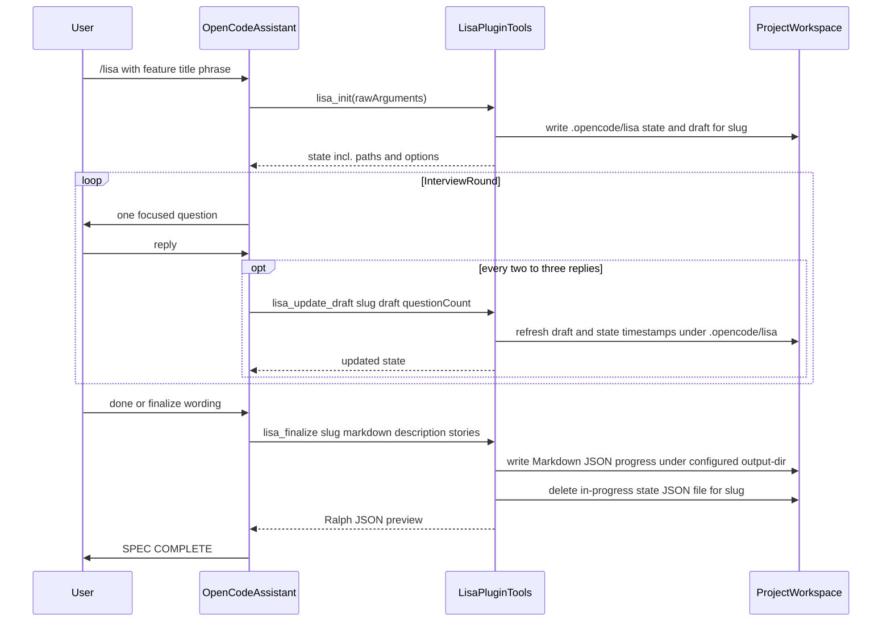
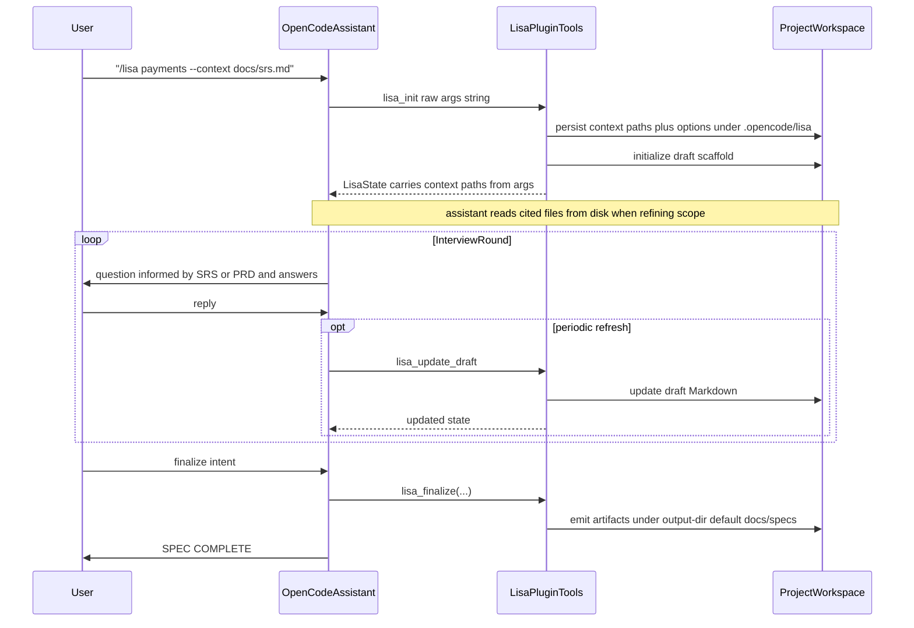
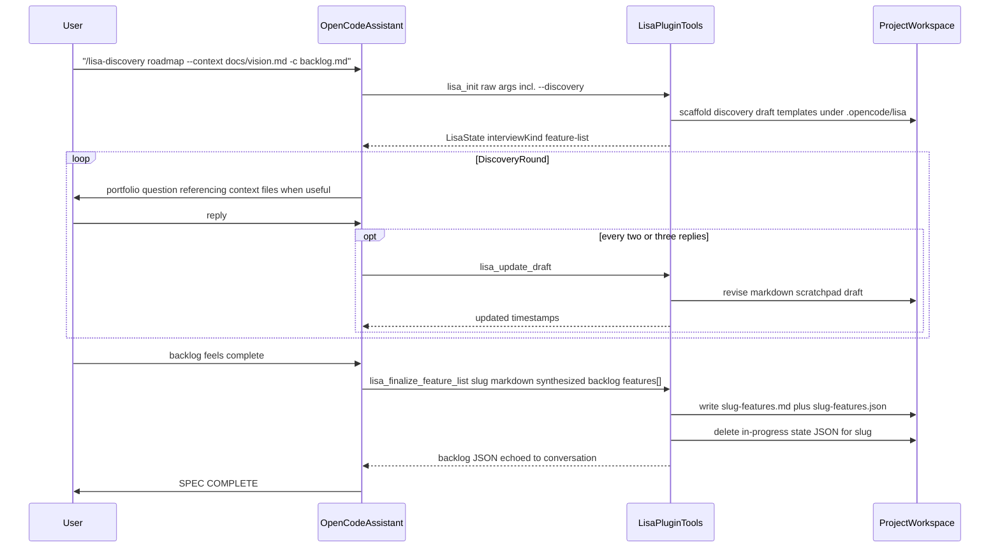
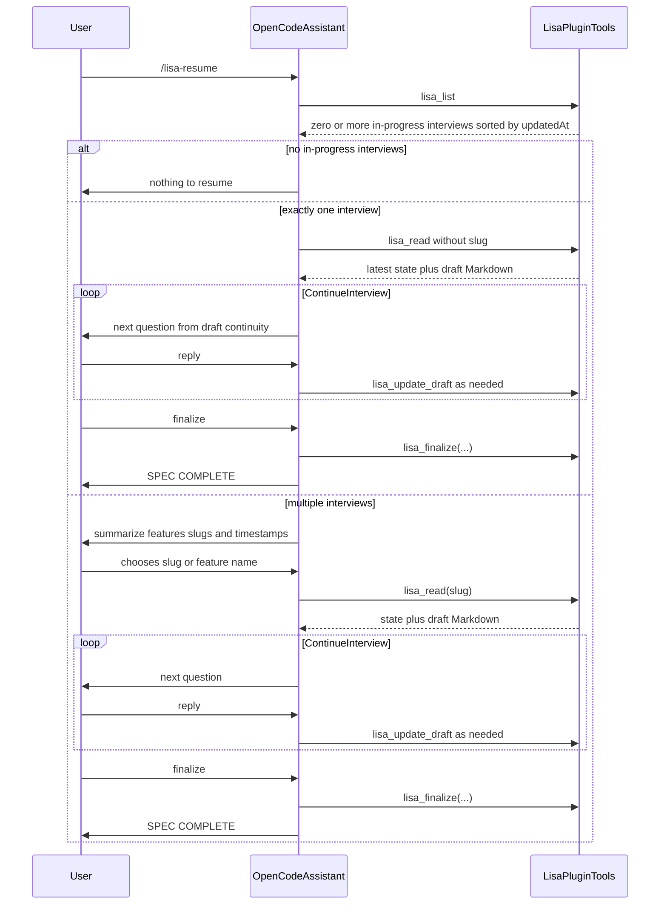
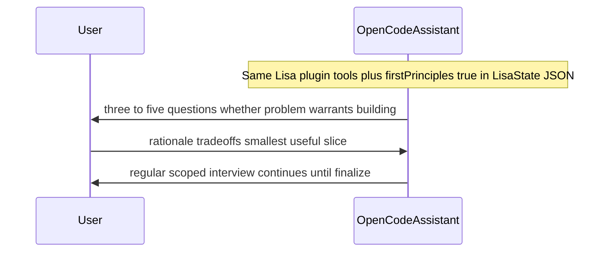
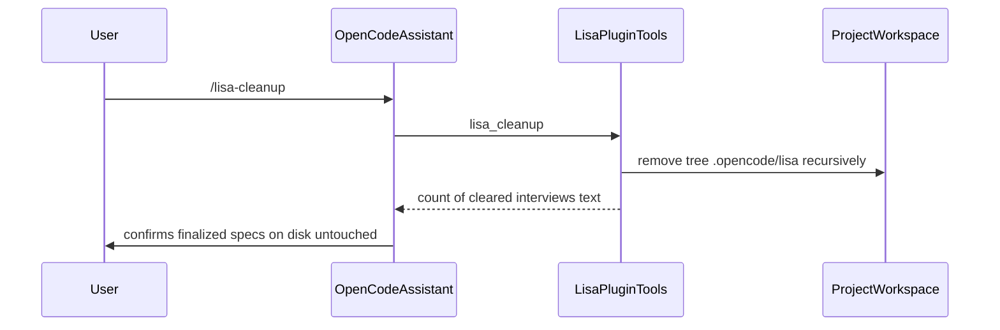

# OpenCode Lisa

Native OpenCode port of [Lisa](https://github.com/blencorp/lisa): an interactive specification interview workflow that turns a feature idea into a Markdown PRD, Ralph-compatible JSON, and a progress file—or, with **`/lisa-discovery`**, a candidate **feature backlog** as Markdown plus JSON alongside your usual specs folder.

Package on npm: [opencode-lisa](https://www.npmjs.com/package/opencode-lisa).

## Requirements

- [OpenCode](https://opencode.ai/docs) installed and usable in your workspace.
- A recent Node.js LTS and npm so you can run **`npx`** (or install the package locally).

## Install

From the consumer project root, add the plugin to `opencode.json`:

```json
{
  "$schema": "https://opencode.ai/config.json",
  "plugin": ["opencode-lisa"]
}
```

From that same project root, copy Lisa’s OpenCode commands and skill into `.opencode/`:

```sh
npx --package opencode-lisa opencode-lisa
```

Equivalent explicit form (default behavior is **`install`**):

```sh
npx --package opencode-lisa opencode-lisa install
```

If you prefer a local dependency:

```sh
npm install -D opencode-lisa
npx opencode-lisa
```

To bootstrap a different project directory (for example in a monorepo when your shell cwd is elsewhere):

```sh
npx --package opencode-lisa opencode-lisa install --cwd /path/to/your/repo
```

`validate` is an alias for **`doctor`**. Older docs may mention **`--opencode`**—that flag still runs **`install`** for compatibility.

That installs the files OpenCode discovers on disk:

- `.opencode/commands/lisa.md`
- `.opencode/commands/lisa-plan.md`
- `.opencode/commands/lisa-discovery.md`
- `.opencode/commands/lisa-resume.md`
- `.opencode/commands/lisa-cleanup.md`
- `.opencode/commands/lisa-help.md`
- `.opencode/skills/lisa/SKILL.md`

OpenCode discovers slash-command suggestions from `.opencode/commands/*.md`, so registering the npm plugin alone is not enough to make `/lisa` appear in suggestions.

If you run the installer from the wrong directory, files land under the wrong `.opencode/` tree; use **`--cwd`** pointing at your project root, or rerun from that root.

Verify the layout at any time:

```sh
npx --package opencode-lisa opencode-lisa doctor
```

If anything is missing, install again with **`opencode-lisa install`** (shown in `doctor` error output).

`opencode-lisa-install` still works as a compatibility alias and installs the same commands and Lisa skill.

## Two-part install

This package has two parts:

1. The npm plugin from `opencode.json`, which exposes the **`lisa_*`** tools (`lisa_init`, `lisa_list`, `lisa_read`, `lisa_update_draft`, `lisa_finalize`, `lisa_finalize_feature_list`, `lisa_cleanup`).
2. The project-local `.opencode` files, which make **`/lisa`**, **`/lisa-discovery`**, and related slashes discoverable and install the Lisa skill.

The bootstrap command above handles the second part so setup is complete and predictable.

## Slash-command arguments

Pass these as part of the slash arguments (parsed wherever raw text is forwarded to **`lisa_init`**—including **`/lisa-discovery`**, which appends **`--discovery`** in its command stub):

| Flag | Short | Description |
|------|-------|--------------|
| `--discovery` | — | Enables **feature-list/project discovery mode** (`interviewKind` becomes **`feature-list`**). Slash **`/lisa-discovery`** folds this flag in for you automatically. |
| `--context <file>` | `-c` | Paths to existing docs (repeatable SRS, backlog, spikes, roadmap notes…). Discovery mode works best when you cite what already exists instead of rewriting it in chat. |
| `--output-dir <dir>` | — | Where finalized artifacts are written; default **`docs/specs`**. |
| `--max-questions <n>` | — | Caps interview length. **`0` (default)** means no limit. |
| `--first-principles` | `-f` | Extra opening phase questioning whether framing is directionally right before deepening detail. |

**Spec mode** (**`/lisa`**) vs **discovery mode**:

- **`interviewKind: "spec"`** — classic single-feature Markdown PRD + Ralph-compatible JSON (`{slug}.md`, `{slug}.json`, `{slug}-progress.txt`).
- **`interviewKind: "feature-list"`** — strategic interviews produce **`{slug}-features.md`** + **`{slug}-features.json`** with normalized candidate rows (**`features[]`**: `title`, `summary`, optional `id`/`FE-###`, rationale, notes). No Ralph **`branchName`/progress TXT** scaffolding.

## Commands

```text
/lisa "user authentication"
/lisa-plan "user authentication"
/lisa-discovery "Q3 roadmap" --context docs/vision.md -c backlog.md --output-dir docs/specs --max-questions 20 --first-principles
/lisa-plan "payments" --context docs/prd.md --output-dir specs --max-questions 15
/lisa-plan "dashboard" --first-principles
/lisa-resume
/lisa-cleanup
/lisa-help
```

**`/lisa`**/**`/lisa-plan`** run **single-feature** interviews. **`/lisa-discovery`** wraps **`--discovery`** for **portfolio-level** brainstorming while still leveraging the same ephemeral `.opencode/lisa/` scratchpads until **`lisa_finalize_feature_list`** runs.

**`/lisa-cleanup`** runs **`lisa_cleanup`**, which removes **all** in-progress Lisa state under **`.opencode/lisa/`** (every draft and state file there). Final Markdown and JSON—including **`{slug}-features.*`** backlog exports—sit under **`--output-dir`** and stay untouched unless you edit them deliberately. Cleanup wipes **every** dangling interview concurrently.

## Verification

1. Run `npx --package opencode-lisa opencode-lisa doctor`.
2. Confirm `.opencode/commands/lisa.md`, `.opencode/commands/lisa-discovery.md`, `.opencode/skills/lisa/SKILL.md`, and sibling command stubs exist side-by-side after install.
3. Start OpenCode in the project.
4. Type `/lisa` or `/lisa-discovery` and confirm each appears among slash-command suggestions.
5. If a command is missing despite files on disk, restart OpenCode rooted in this repository.
6. Run `/lisa-help`, `/lisa "smoke"` or `/lisa-discovery "smoke-session"` depending on desired mode.

## Upgrading

```sh
npx --package opencode-lisa opencode-lisa
```

That refreshes the managed command and skill files under `.opencode/`.

Pin a release when you want a predictable refresh:

```sh
npx --package opencode-lisa@<version> opencode-lisa
```

Older examples that mention `opencode-lisa-install` refer to the compatibility installer binary, not a different npm package. The npm package name is **`opencode-lisa`**.

If you previously installed **`@0xarcano/open-lisa`**, switch your `opencode.json` entry and `npx --package ...` commands to **`opencode-lisa`**.

## Runtime Files

During an interview, ephemeral state lives under `.opencode/lisa/`:

- `.opencode/lisa/state/{slug}.json`
- `.opencode/lisa/draft/{slug}.md`

When you finalize a **single-feature** interview (**`interviewKind: "spec"`**), Lisa emits the classic trio:

- `{output-dir}/{slug}.md` — Markdown PRD
- `{output-dir}/{slug}.json` — Ralph-oriented payload: **`project`** (slug), **`branchName`** (`ralph/<slug>`), **`description`**, **`userStories`**
- `{output-dir}/{slug}-progress.txt` — One line per story, e.g. `[PENDING] US-001 - Story title`

Discovery backlogs (**`interviewKind: "feature-list"`**) instead persist:

- `{output-dir}/{slug}-features.md` — Markdown narrative outlining agreed themes + candidate capabilities
- `{output-dir}/{slug}-features.json` — Machine-readable backlog with **`generatedAt`** + **`features`** array (**`FE-###`** ids normalized when missing)

The default root for both families is **`docs/specs`** (still overridable with **`--output-dir`**).

After finalization, the state JSON for that slug disappears from `.opencode/lisa/state/`. **`lisa_finalize`** and **`lisa_finalize_feature_list` both intentionally leave `.opencode/lisa/draft/*.md`** in place unless you prune them manually—the scratchpad survives as a breadcrumb alongside your outputs.

## Workflow

**`/lisa`** drives **narrow** capability specs; **`/lisa-discovery`** (which prepends **`--discovery`**) gathers **portfolio-level** backlog context. **`/lisa-resume`** rehydrates whichever kind you left mid-flight—the agent compares **`state.interviewKind`** to decide between **`lisa_finalize`** versus **`lisa_finalize_feature_list`**. Interviews finalize only once you verbally wrap (`done`, `finalize`, …), emit **`SPEC COMPLETE`**, and never implicitly implement code unless you stray off-script.

Refer to **Slash-command arguments** for **`--first-principles`** aliases and discovery toggles (`-f`, `--discovery`).

## Workflow diagrams

These diagrams show how the slash commands, **`lisa_*`** tools ([plugin](src/index.ts)), and workspace files interact. **`OpenCodeAssistant`** is any primary agent obeying the command templates under **`.opencode/commands/`**.

### Interview from a feature title only



### Interview with SRS or PRD as `--context`



### Project discovery and feature backlog

`/lisa-discovery` stamps **`--discovery`** onto the forwarded arguments so **`lisa_init` tags the session as **`interviewKind: "feature-list"`**. Use repeat **`--context` / `-c`** flags identical to **`/lisa`**.



### Resume after an interruption

**Important:** Inspect **`state.interviewKind`** after **`lisa_read`**.

- **`"feature-list"`** → **`lisa_finalize_feature_list`**
- **`"spec"`** → **`lisa_finalize`**

The sequence below remains structurally identical; swap the finalize tool accordingly when each branch resumes.



### First-principles mode on the same path



### Discard every in-progress interview



## Git hygiene

Add **`.opencode/lisa/`** to **`.gitignore`** if you don’t want interview state and drafts in version control (you often still commit **`.opencode/commands/`** and **`.opencode/skills/`**).

## Development

```sh
npm install
npm run build
npm test
```
